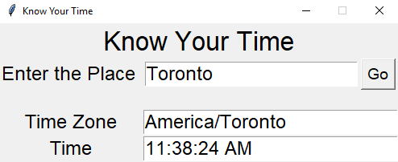

# KYT (Know Your Time)

------------------------------
## Demo

[How To Use](Manual.md)
-------------------------------
* Before Making any Contribution make sure you read the [Guidelines](Guidelines.md) properly.
* Struck and Unable to make any Contributions even if you want check out [How to Contribute](how_to_contribute.md)
* New to GiHub?
  * [Intro to GitHub](https://www.youtube.com/watch?v=V4K6Dy9DWm8)
  * [How to Create a Repository](https://www.youtube.com/watch?v=VWzQSXCTLOM)
  * [Cloning a Repository](https://www.youtube.com/watch?v=L2_XikMM0nI)
  * [Contributing to a Project](https://www.youtube.com/watch?v=b-hGpPrVcus)
-------------------------------- 
#### We made This Repository using Python. If you find it a little bit fun or mind refreshing feel free to drop a :star:
